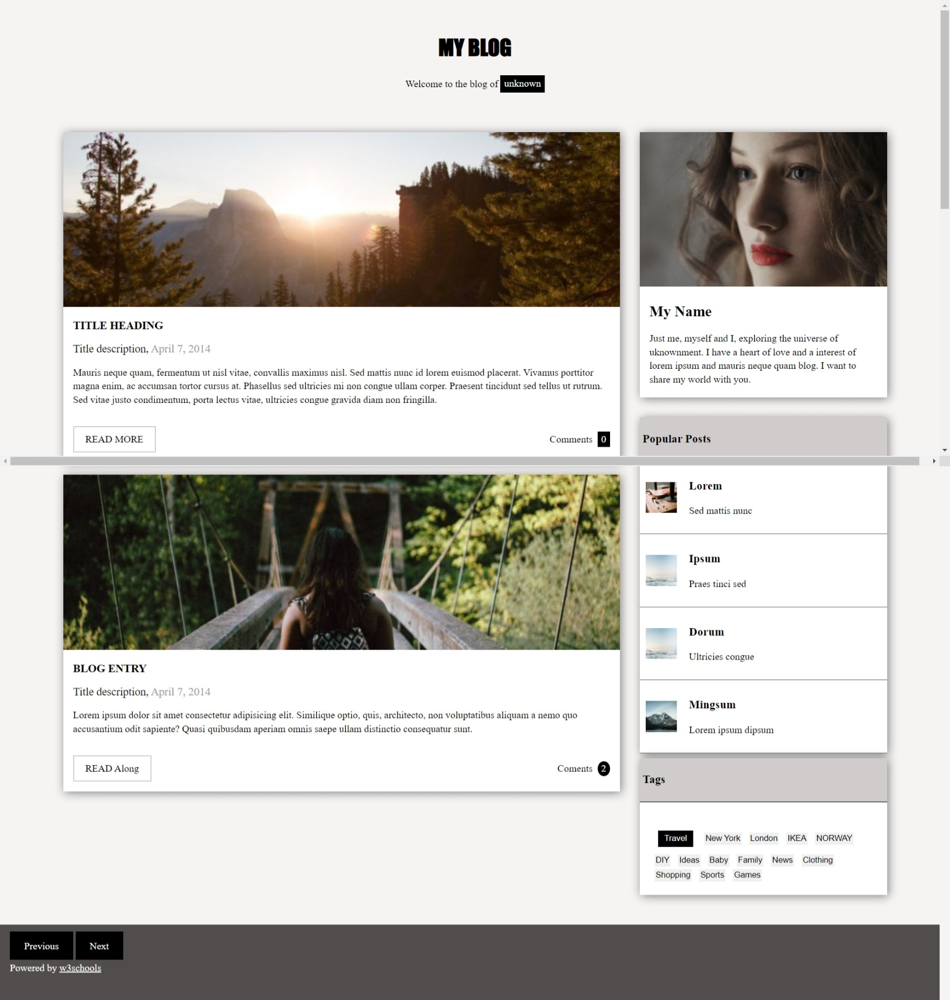

# BLOG

## ABOUT

-This is a blog template project amongst 7 projects given to i and my mates as an assignment to test our skills on html and css.

## App

### Built With

- HTML
- CSS
### Prerequisites

Knowledge about:

- HTML
- CSS
- Google chrome

## Clone project

- To get a local copy up and running follow these simple example steps.
- Clone this repository with `https://github.com/kivenalaric/blog-template.git` using your terminal.
- Change to the project directory by entering: cd blog in the terminal.

## steps

- $ git clone `https://github.com/kivenalaric/blog-template.git`
- $ `cd blog`
- $ `git checkout feature/responsive`

## Start App

- run by opening the index.html in the browser

## Author

👤 **KivenAlaric**

- GitHub: [@kivenalaric](https://github.com/kivenalaric/blog-template.git)

## 📝 License

This project is [w3school](./LICENSE) licensed.
